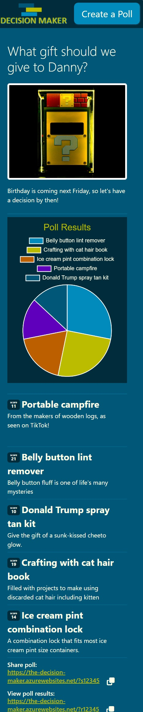
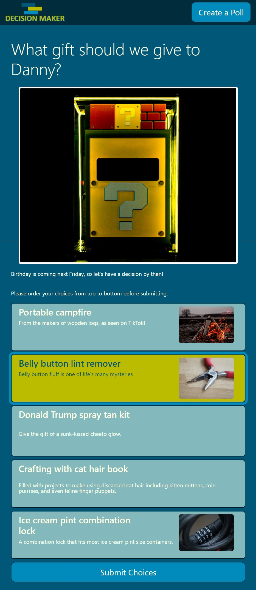
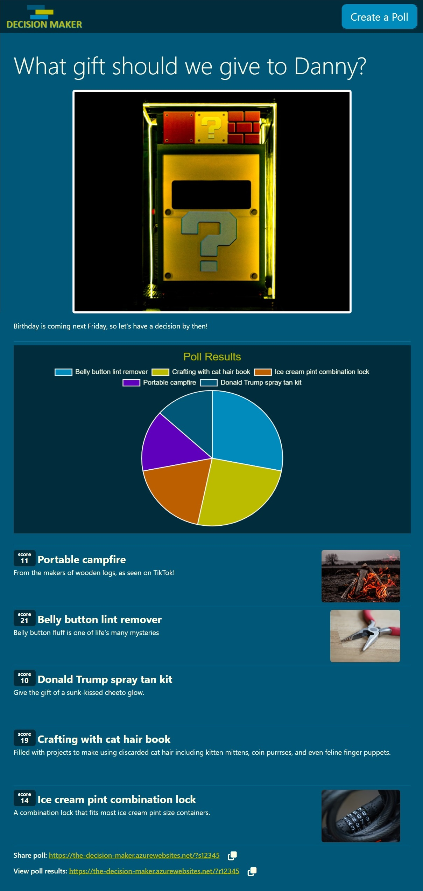

LHL Node Skeleton
=========

## About this project
* This is the Lighthouse Labs web development bootcamp mid-term project option 4: Decision Maker
* This web app helps groups of friends to vote on a preferred choice (using ranked voting), for example: "What movie should we see next Friday?"
* We chose the app because we knew we had more time than normal for this project and felt we could expand it to add extra features if we wanted that would be challenging to develop but simple to use. 
* Also, it was different enough from what we've done in bootcamp thus far while still being able to use the skills we've developed.

## Screenshots (click image thumbnail for full size)

<table>
  <tr>
    <th> Description </th>
    <th> Image Thumbnail </th>
  </tr>
  <tr>
    <td>
      Creating a new poll on a narrow screen like an iPhone SE:
    </td>
    <td style="text-align: center">
      
    </td>
  </tr>
  <tr>
    <td>
      Answering a poll on a mid-width screen like an iPad Air:
    </td>
    <td style="text-align: center">
      
    </td>
  </tr>
  <tr>
    <td>
      Viewing the results of a poll on a wide screen like a PC:
    </td>
    <td style="text-align: center">
      
    </td>
  </tr>
</table>

## Setup
1. Clone your own copy of this repo using the `<> Code` button, then copy the SSH link for use in terminal on your dev machine.
2. Add any team members as collaborators to the project so that they can push to this repo.
3. Let your team members know the repo URL so that they use the same repo (they should _not_ create a copy/fork of this repo since that will add additional workflow complexity to the project)

## Getting Started
1. Create the `.env` by using `.env.example` as a reference: `cp .env.example .env`
2. Update the .env file with your correct local information 
  - username: `labber` 
  - password: `labber` 
  - database: `midterm`
3. Install dependencies: `npm i`
4. Fix to binaries for sass: `npm rebuild node-sass`
5. Reset database: `node bin/resetdb.js`
  - Check the db folder to see what gets created and seeded in the SDB
6. Run the server: `npm run local`
  - Note: nodemon is used, so you should not have to restart your server
7. Visit `http://localhost:8080/`

## Warnings & Tips
- Do not edit the `public/styles/custom.css` file directly, it is auto-generated by `styles/custom.scss`.
- Use the `node bin/resetdb.js` command each time there is a change to the database schema or seeds or to reset the database. 
  - It runs through each of the files, in order, and executes them against the database. 
  - Note: you will lose all newly created (test) data each time this is run, since the schema files will `DROP` the tables and recreate them.

## Dependencies
- Node 10.x or above
- NPM 5.x or above
- chalk 2.4.2,
- dotenv 2.0.0
- express 4.17.1
- express-validator 6.14.2
- morgan 1.9.1
- pg 8.5.0
- sass 1.35.1
- sib-api-v3-sdk 8.5.0
- nodemon 2.0.10 (DEV)